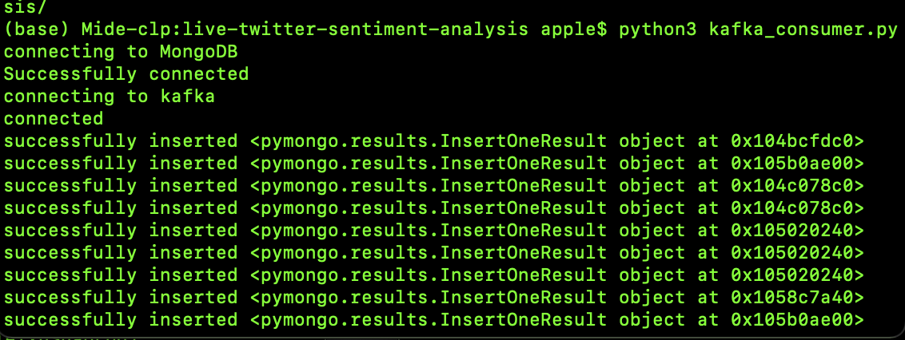

# Live-twitter-sentiment-analysis

## Overview
When a company or brand launches a new product, they would like to know how the 
product is performing and what is said about it. This repository contain scripts that can be used
to perform user sentiment analysis by using Twitter API to get live tweets from users 
for analysis.

**Note you need to have ELEVATED access for twitter API, for the twitter producer script to run**

## Architecture


## Process
* Stream tweets from Twitter using keywords to filter tweets.
* Use kafka producer to publish event into topic.
* Use apache spark to read event from the topic, create a  DataFrame and perform sentiment analysis on them.
* write analyzed data back to kafka with another topic 
* Use Kafka consumer to read event and write the event data to mongodb

## Environment and dependency setup

### Create a new virtual environment
`python3 -m venv env`  This creates an env folder in the directory 

Activate the virtual environment `source env/bin/activate`

run ```pip3 install -r requirements.txt``` this installs all the packages needed

### Set up MongoDB
_**Start MongoDb in a new terminal,**_ use `mongo` to start the mongo database

Create database twitter with the following command `use twitter`

create collection with the following command `db.createCollection("collectionName")`
### Set up kafka and spark
Use the instruction here to setup spark 
```https://medium.com/beeranddiapers/installing-apache-spark-on-mac-os-ce416007d79f``` 


Download Kafka `https://www.apache.org/dyn/closer.cgi?path=/kafka/3.1.0/kafka_2.13-3.1.0.tgz` 

unzip the kafka folder 
```
tar -xzf kafka_2.13-3.1.0.tgz
cd kafka_2.13-3.1.0
```

Start Zookeeper
```
bin/zookeeper-server-start.sh config/zookeeper.properties
```

_**Open new terminal or bash**_ 

Start the Kafka broker service

```
cd kafka_2.13-3.1.0
bin/kafka-server-start.sh config/server.properties
```
_**Open new terminal or bash**_ 

Create topics
```
cd kafka_2.13-3.1.0
bin/kafka-topics.sh --create --topic tweets_loader --bootstrap-server localhost:9092
bin/kafka-topics.sh --create --topic tweets_loader_from_kafka --bootstrap-server localhost:9092
```

## How to run
_**Open new terminal or bash**_ 

#### Run spark job

in the project folder run
```
spark-submit --packages org.apache.spark:spark-streaming-kafka-0-10_2.12:3.2.1,org.apache.spark:spark-sql-kafka-0-10_2.12:3.2.1 spark_streaming.py
```


_**Open new terminal or bash**_ 
#### Run Kafka consumer
```
python3 kafka_consumer.py
```
_**Open new terminal or bash**_ 

#### Run Kafka twitter producer

```
python3 twitter-producer.py
```

### view when inserting into the database



### view of data in the database


